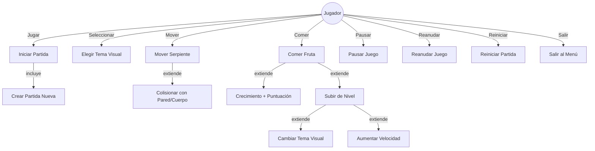
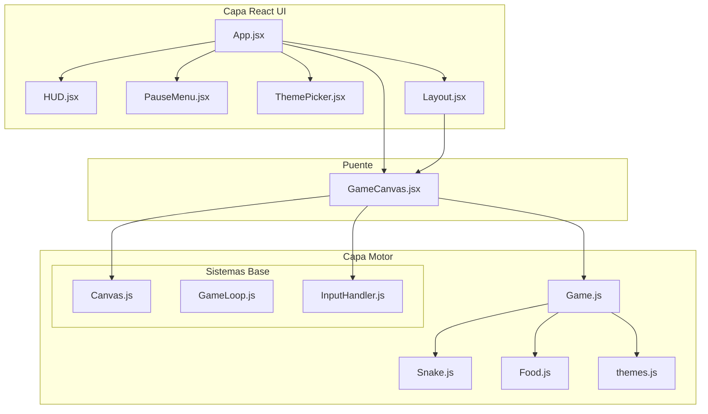
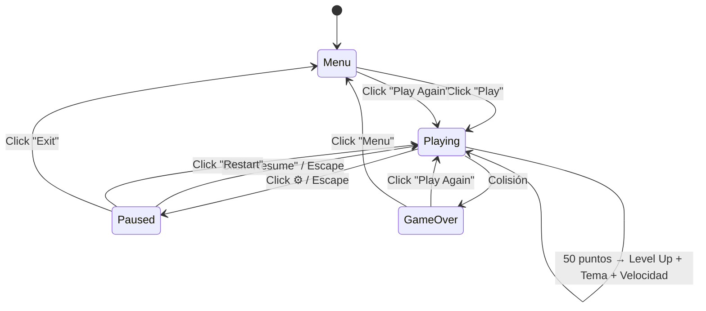
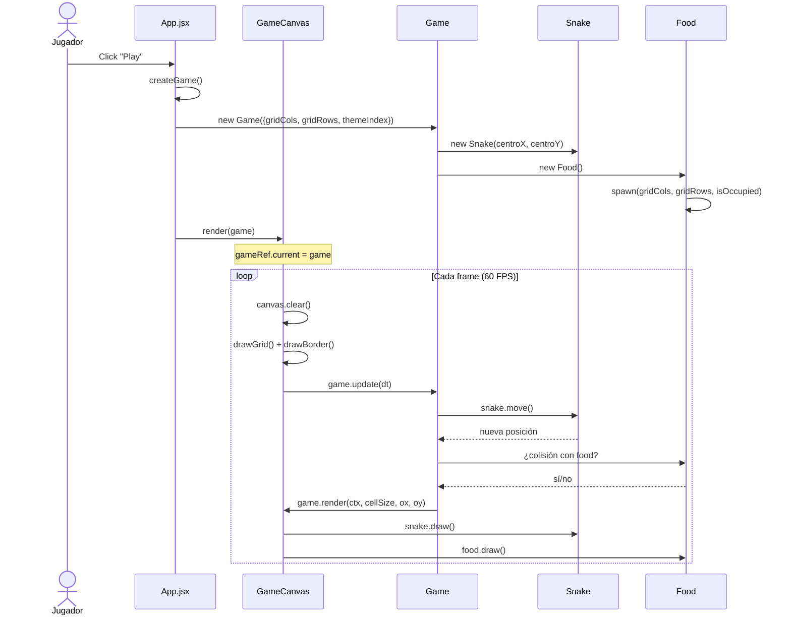
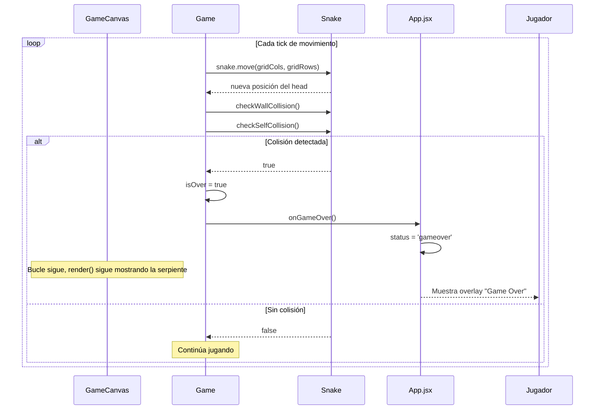
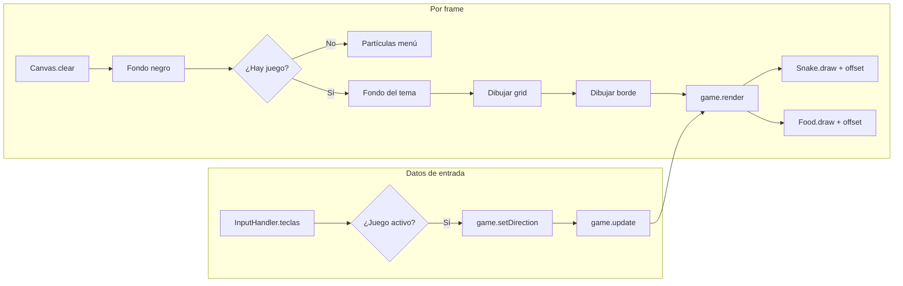

# Diagramas de NeoWorm

Todos los diagramas están escritos en sintaxis **Mermaid** y se renderizan automáticamente en editores compatibles (GitHub, VS Code con extensión Mermaid, etc.).

---

## 1. Diagrama de Casos de Uso

---

## 2. Diagrama de Componentes

---

## 3. Diagrama de Flujo del Juego

---

## 4. Diagrama de Secuencia — Inicio de Partida

---

## 5. Diagrama de Secuencia — Colisión y Game Over

---

## 6. Diagrama de Flujo de Datos — Renderizado

---

## 7. Diagrama de Despliegue (futuro)

```mermaid
graph TB
    subgraph "Cliente (Navegador)"
        A[Static Files: HTML/CSS/JS]
        B[Canvas 2D Renderer]
        C[React UI]
        D[LocalStorage]
    end
    
    subgraph "Servidor (planeado)"
        E[Supabase / Render]
        F[Leaderboard API]
        G[Autenticación]
    end
    
    A --> B
    A --> C
    C --> D
    C -.->|HTTP| E
    E --> F
    E --> G
    
    style A fill:#1a1a2e,stroke:#0f0
    style B fill:#16213e,stroke:#0f0
    style C fill:#0f3460,stroke:#0f0
```

---

## 8. Diagrama de Temas (mapeo nivel → tema)

```mermaid
graph LR
    subgraph "Niveles 1-10"
        L1[Level 1] --> T1[Classic]
        L2[Level 2] --> T2[Neon City]
        L3[Level 3] --> T3[Toxic Swamp]
        L4[Level 4] --> T4[Deep Space]
        L5[Level 5] --> T5[Lava Core]
        L6[Level 6] --> T6[Arctic Frost]
        L7[Level 7] --> T7[Sunset Drive]
        L8[Level 8] --> T8[Midnight Purple]
        L9[Level 9] --> T9[Golden Sands]
        L10[Level 10] --> T10[Ocean Depths]
    end
    
    L1 -.->|Si se eligió tema| TemaElegido[Theme elegido por el usuario]
    
    style T1 fill:#0a0a0a,stroke:#0f0
    style T2 fill:#0a0015,stroke:#0ff
    style T3 fill:#0a1005,stroke:#af0
    style T4 fill:#050510,stroke:#a4f
    style T5 fill:#100500,stroke:#f40
    style T6 fill:#0a1018,stroke:#8df
    style T7 fill:#120a08,stroke:#f84
    style T8 fill:#080012,stroke:#c8f
    style T9 fill:#0e0c06,stroke:#fc3
    style T10 fill:#040e12,stroke:#0da
```

